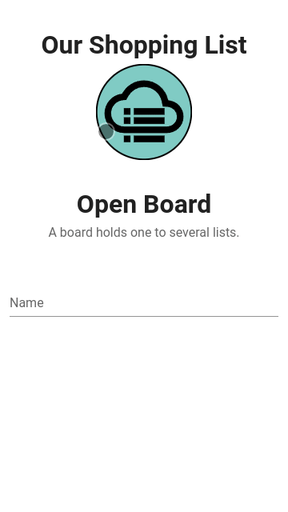

<a href="https://github.com/nanawel/our-shopping-list">
  
</a>

# Our Shopping List

OSL is a simple **shared list** application. Typical uses include **shopping
lists** of course, and any other small todo-list that needs to be used
**collaboratively**.

<p align="center"></p>

The current implementation provides the following features:
- **Multiple boards** (can be disabled, see `VUE_APP_SINGLEBOARD_MODE`)
- Each board with **multiple lists**
- **Real-time sync** between users
- Items with the following fields: name, quantity, details
- **Checkable** items
- 2 **display modes** for items (unchecked only / checked only, sorted by check time)
- Intuitive **search**
- **Mobile-first UI** with swipeable items
- [PWA](https://en.wikipedia.org/wiki/Progressive_web_application) basic support
- Partial internationalisation (i18n)
  - Only EN and FR languages are available at that time, but PR are welcome for more!
    See examples [here](./client/src/locales).

But, at this date it lacks the following:
- Full PWA support with offline mode and deferred sync

## ⭐ New in v2: Boards feature

Before v2, **all of the lists** on an instance were available to **all users**.

Version 2 introduces a new feature called "boards". It's simply a way to group
lists together under a common name. That name can then be shared so that
people use the lists from a board collaboratively.

But, you might want to disable that feature and keep using a unique board for
your whole instance. In that case, just use the provided
`VUE_APP_SINGLEBOARD_MODE` environment variable.

**But have no fear, you can always:**

- Switch from _singleboard_ mode to multi-board
  - In that case you'll have to
    create a new board and choose it as target for existing lists with the
    provided CLI tool.
- Switch from multi-board mode to _singleboard_
  - In that case you can choose which lists to migrate to the special
    unique board, but you'll lose access to all other lists (they are not
    deleted, just not accessible anymore)

> See next § for instructions on how to enable one mode or the other.

## ☝ Instructions when migrating from v1 to v2

Version 2 has added the _multiboard_ feature which changes the default mode
the application runs into.

If you already had a working v1, and would like to upgrade to v2 please follow
the steps below:

> ⚠ **Back up your data before proceeding!**

### If you want to keep using one single board on your instance (just like on v1)

  - Make sure you set the `VUE_APP_SINGLEBOARD_MODE` to `1`
  - Once started, use the CLI to migrate existing lists to the special board
    used as common parent for lists in "singleboard" mode.
    ```shell
    docker-compose exec app node cli.js board:create --singleboard
    docker-compose exec app node cli.js list:move-to-board --all --singleboard
    ```
  - Use the application as usual (you might have to clear your browser's cache
    to make sure there's no invalid data left).

### If you want to enable the new _boards_ feature and migrate your existing lists to a dedicated board

  - Make sure `VUE_APP_SINGLEBOARD_MODE` is **not set** or set to `0`
  - Create a new board with the name of your choice
    ```shell
    # Get the created board's slug from the output and use it in the following command
    docker-compose exec app node cli.js board:create my-board
    docker-compose exec app node cli.js list:move-to-board --all --board my-board
    ```
  - Open the application, and from the home screen open the board you've just created
    to find your lists.

## 🖼 Screenshots

### Mobile

> ☝ Screenshots are from v1, but v2 looks mostly the same.

<a href="doc/mobile-01.png">
  
</a>

<details>
  <summary>Click here to see more!</summary>
  <a href="doc/mobile-02-menu.png">
    
  </a>
  <a href="doc/mobile-03-search.png">
    
  </a>
  <a href="doc/mobile-04-edit-list.png">
    
  </a>
</details>

### Desktop

> ☝ Screenshots are from v1, but v2 looks mostly the same.

<a href="doc/desktop-01.png">
  
</a>

<details>
  <summary>Click here to see more!</summary>
  <a href="doc/desktop-01-swipe.png">
    
  </a>
  <a href="doc/desktop-02-edit-item.png">
    
  </a>
  <a href="doc/desktop-03-search.png">
    
  </a>
</details>

## 📦 Installation

### 🐋 With Docker

With a running [MongoDB 4.x](https://hub.docker.com/_/mongo) container as
`mymongo` on the host:

```shell
docker run --detach \
  --name our-shopping-list \
  --link mymongo:mongodb \
  --publish 80:8080 \
  nanawel/our-shopping-list
```

### 🐋 With `docker-compose`

Use the provided [`docker-compose.yml`](doc/docker-compose.yml) and adapt it to
your needs.

Then to start the containers:

```shell
docker-compose up -d
```

**Available environment variables for the `app` container**

- **System keys**
  - `LISTEN_PORT` (default: `8080`)
  - `MONGODB_HOST` (default: `mongodb`)
  - `MONGODB_PORT` (default: `27017`)
  - `MONGODB_DB` (default: `osl`)
  - `BASE_URL` (default: _empty_) Set to base path if your web root is not `/` (ex: `/my-osl/`)

  > MongoDB authentication is not supported yet.

- **Application keys**
  - `VUE_APP_CHECKED_ITEMS_HISTORY_SORT_FIELD` (default: `lastCheckedAt`, see available fields [here](./client/src/models/Item.js))
  - `VUE_APP_CHECKED_ITEMS_HISTORY_SORT_ORDER` (default: `desc`)
  - `VUE_APP_CLIENT_LOG_CONSOLE_ENABLED` (default: `false`, [see doc here](https://github.com/dev-tavern/vue-logger-plugin/tree/v1.2.3#enabled-vs-consoleenabled))
  - `VUE_APP_CLIENT_LOG_ENABLED` (default: `false`, [see doc here](https://github.com/dev-tavern/vue-logger-plugin/tree/v1.2.3#enabled-vs-consoleenabled))
  - `VUE_APP_CLIENT_LOG_LEVEL` (default: `debug`)
  - `VUE_APP_I18N_FALLBACK_LOCALE` (default: `en`)
  - `VUE_APP_I18N_FORCE_LOCALE` (default: `0`)
  - `VUE_APP_I18N_LOCALE` (default: `en`)
  - `VUE_APP_LIST_ALL_BOARDS_ENABLED` (default: `0`, has no effect in _singleboard_ mode)
  - `VUE_APP_LOCALSTORAGE_KEY_PREFIX` (default: `OurShoppingList_`)
  - `VUE_APP_SHORT_TITLE` (default: `OSL`)
  - `VUE_APP_SINGLEBOARD_MODE` (default: `0`)
  - `VUE_APP_TITLE` (default: `Our Shopping List`)

### Robots.txt

By default, the embedded `robots.txt` prevents search engines from browsing the application:

```
User-agent: *
Disallow: /
```

You can change this behavior by mounting the `robots.txt` of your choice at `/app/robots.txt` in the container.

### 🗒 Notes for reverse-proxy (SSL offloading)

OSL uses a WebSocket to allow server-to-client communication. So using a
reverse-proxy to forward the connection implies the presence of the following
sections in the corresponding VirtualHost:

```
<Proxy *>
    Allow from all
</Proxy>
ProxyPass         /  http://127.0.0.1:8080/
ProxyPassReverse  /  http://127.0.0.1:8080/
ProxyPreserveHost On

RewriteEngine On
RewriteCond %{HTTP:Upgrade} =websocket [NC]
RewriteRule /(.*)           ws://127.0.0.1:8080/$1 [P,L]
RewriteCond %{HTTP:Upgrade} !=websocket [NC]
RewriteRule /(.*)           http://127.0.0.1:8080/$1 [P,L]
```

Replace `127.0.0.1` and `8080` with the IP of the OSL host if your RP is not
the host itself and/or if you're using another port.

> Those instructions are given for Apache, but you can easily find the
> corresponding directives for Nginx with a little search.

### ⚠ Notes when serving multiple instances on different web roots

Remember to set the `BASE_URL` variable to the matching web root on each instance.

Make sure you set `VUE_APP_LOCALSTORAGE_KEY_PREFIX` to a unique value too, otherwise clients switching from
one instance to another might corrupt the internal cache in their browser.

Example:

- 1st instance on https://my.host/public-osl
  - `BASE_URL` = `public-osl/`
  - `VUE_APP_LOCALSTORAGE_KEY_PREFIX` = `OSL1_`
- 2nd instance on https://my.host/private-osl
  - `BASE_URL` = `private-osl/`
  - `VUE_APP_LOCALSTORAGE_KEY_PREFIX` = `OSL2_`
- etc.

## 👷 Developer installation

> 🐋 This method also uses Docker, but with the local source files mounted
> into the `node` container.

First of all, clone this project in the directory of your choice. Then from it:

```shell
make dev-pull
make dev-init
make dev-upd
```

Now start the Webpack Development Server with

```shell
make dev-watch
```

> If you don't, you'll get 504 errors in the console on `/sockjs-node/*` requests
> and you won't get hot reloading on changes.

If you want to enter the container, just use

```shell
make dev-shell
```

### Special cases

In development mode, the service worker is not enabled.
To workaround this limitation, you may want to ponctually build the JS bundle
in "production" mode.

Here's how:

```shell
make dev-shell

cd client/
NODE_ENV=production yarn build
```

Then reload the page in your browser and the SW should be activated.
You have to make sure you are running the app **with TLS enabled**. Use the
`ENABLE_TLS` variable to use the embedded TLS proxy if needed.
