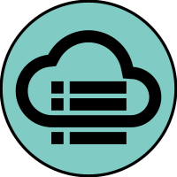
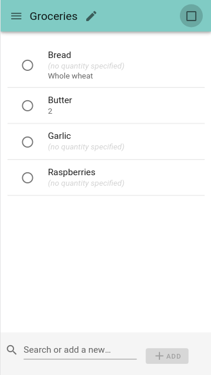
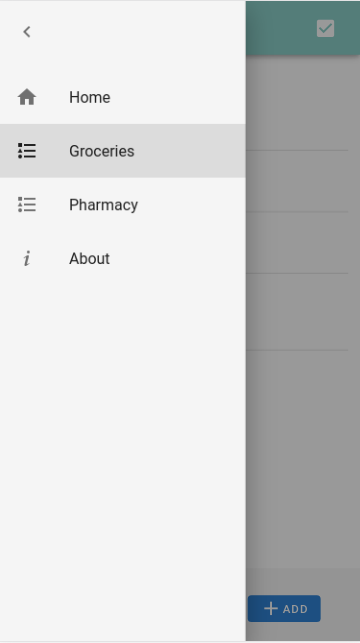
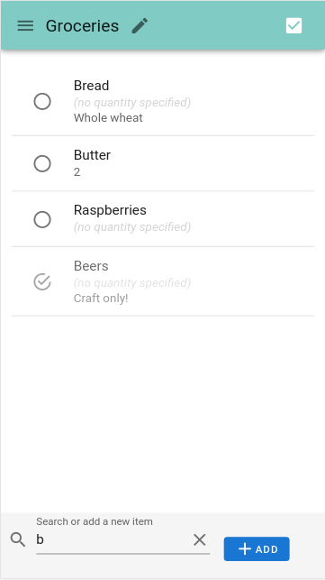
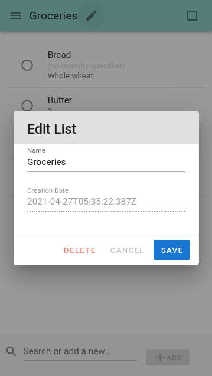
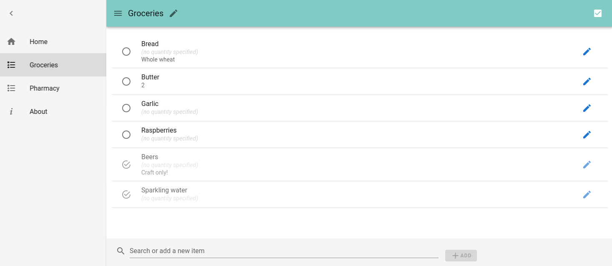
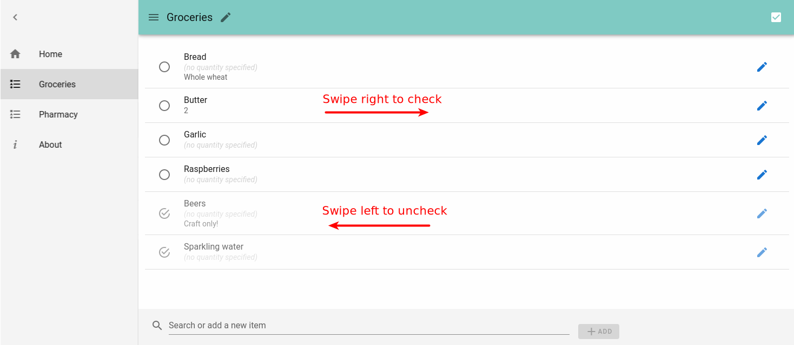
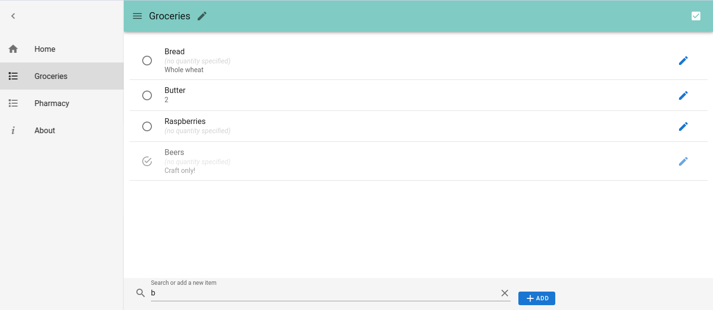

<a href="https://github.com/nanawel/our-shopping-list">
  
</a>

# Our Shopping List

OSL is a simple **shared list** application. Typical uses include **shopping
lists** of course, and any other small todo-list that needs to be used
**collaboratively**.

The current implementation provides the following features:
- **Multiple lists**
- **Real-time sync** between users
- Items with the following fields: name, quantity, details
- **Checkable** items
- 2 **display modes** for items (unchecked only / all)
- Intuitive **search**
- **Mobile-first UI** with swipeable items
- [PWA](https://en.wikipedia.org/wiki/Progressive_web_application) basic support

But, at this date it lacks the following:
- Multi-account support[^1]
- Full PWA support with offline mode and deferred sync

[^1]: It means that a server instance currently exposes **all** lists to **all**
users/clients, since there's no concept of "user account" yet.

## Screenshots

### Mobile

<a href="doc/mobile-01.png">
  
</a>
<a href="doc/mobile-02-menu.png">
  
</a>
<a href="doc/mobile-03-search.png">
  
</a>
<a href="doc/mobile-04-edit-list.png">
  
</a>

### Desktop

<a href="doc/desktop-01.png">
  
</a>
<a href="doc/desktop-01-swipe.png">
  
</a>
<a href="doc/desktop-02-edit-item.png">
  
</a>
<a href="doc/desktop-03-search.png">
  
</a>

## :package: Installation

### :whale: With Docker

With a running [MongoDB 4.x](https://hub.docker.com/_/mongo) container as
`mymongo` on the host:

```shell
docker run --detach \
  --name our-shopping-list \
  --link mymongo:mongodb \
  --publish 80:8080 \
  nanawel/our-shopping-list
```

### :whale: With `docker-compose`

Use the provided [`docker-compose.yml`](docker-compose.yml) and adapt it to your
needs (you might want to take a look to the [`.env`](.env) file too).

Then to run:

```shell
docker-compose up -d
```

**Usable environment variables for the `app` container**

- `LISTEN_PORT` (default : `8080`)
- `MONGODB_HOST` (default : `mongodb`)
- `MONGODB_PORT` (default : `27017`)
- `MONGODB_DB` (default : `osl`)

> MongoDB authentication is not supported yet.

### :twisted_rightwards_arrows: Notes for reverse-proxy (SSL offloading)

OSL uses a WebSocket to allow server-to-client communication. So using a
reverse-proxy to forward the connection implies the presence of the following
sections in the corresponding VirtualHost:

```
<Proxy *>
    Allow from all
</Proxy>
ProxyPass         /  http://127.0.0.1:8080/
ProxyPassReverse  /  http://127.0.0.1:8080/
ProxyPreserveHost On

RewriteEngine On
RewriteCond %{HTTP:Upgrade} =websocket [NC]
RewriteRule /(.*)           ws://127.0.0.1:8080/$1 [P,L]
RewriteCond %{HTTP:Upgrade} !=websocket [NC]
RewriteRule /(.*)           http://127.0.0.1:8080/$1 [P,L]
```

> Those instructions are given for Apache, but you can easily find the
> corresponding directives for Nginx with a little search.

## :construction_worker: Developer installation

> :whale: This method also uses Docker, but with the local source files mounted
> into the `node` container.

First of all, clone this project in the directory of your choice. Then from it:

```shell
make dev-pull
make dev-init
make dev-upd
```

You may now enter the container and start the Webpack Development Server with
```shell
make dev-shell

cd client/
yarn serve
```